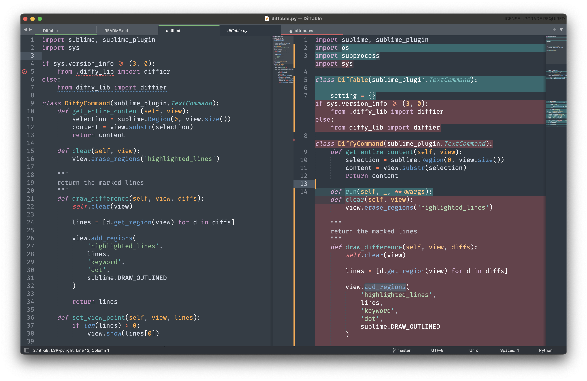

# Diffable

This is a file comparison plugin for Sublime Text 3/4, it relies on its internal [Incremental Diff](http://www.sublimetext.com/docs/incremental_diff.html) feature.

Enjoy!

## Features

1. To present inline diff of content of two opened tabs to one another.
2. To pass the content of two opened tabs to [Kaleidoscope](https://kaleidoscope.app) diff app.
3. To clear inline diff.

## Installation

Please install Sublime [Package Control](https://sublime.wbond.net/installation) first. Then inside *Package Control: Install Package*, type *Diffable* and then click to confirm.

## Usage

It's as easy as just:

1. Install the plugin.
2. Open two tabs in a row either way.
3. Hit bindings bellow or run it by Sublime Text Command Pallet by typing `Diffable`.
4. Bonus: By hitting `super+k` followed by `super+/`, you'll get inline diff view provided by Sublime Text.

## Screenshots

<details><summary>Click to see screens</summary>





</details>

## Bindings

1. To compare and show the diffs, press `super + k` followed by `super + d`.
2. To clear the marked lines, press `super + k` followed by `super + c`.
3. To pass presented content into Kaleidoscope app press `super + k` followed by `super + o`.

## Settings
### The default key binding for Mac is

```
{ "keys": ["super+k", "super+d"], "command": "diffable", "args": {"action": "inline"} }
{ "keys": ["super+k", "super+c"], "command": "diffable", "args": {"action": "clear"} }
{ "keys": ["super+k", "super+o"], "command": "diffable", "args": {"action": "kaleidoscope"} }
```

### The default key binding for Windows / Linux is

```
{ "keys": ["ctrl+k", "ctrl+d"], "command": "diffable", "args": {"action": "inline"} }
{ "keys": ["ctrl+k", "ctrl+c"], "command": "diffable", "args": {"action": "clear"} }
```
> **Warning**
> There's no version of Kaleidoscope app for both Windows and Linux.

## Known issues

Inline diffs looks corrupted on git repos uncommited changes, to fix that please commit or reset your local changes.

## Disclaimer

> **Note**
> This plugin is a refactored and updated verion of an ammazing plugin https://github.com/zsong/diffy which is seems depricated long ago.

> **Note**
> None of the team stand behind Kaleidoscope app have paid me any amount for being a part of this plugin behind the scene. Though they were so kind to provide me a code snippet that let me integrate with their tool in a smooth way.

> **Note**
> Therefore any other diffing tool are more than welcome to become integrated on the same terms as they were — by PR to that repo.